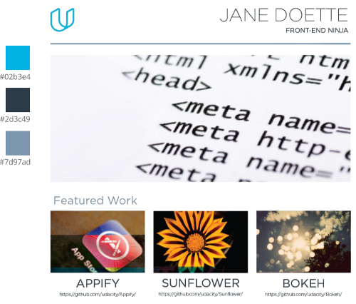
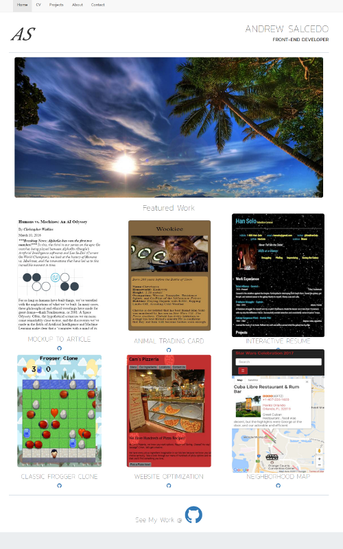

# Udacity Portfolio

## Overview

Build a portfolio site using HTML & CSS that replicates the [design mockup PDF-file](https://storage.googleapis.com/supplemental_media/udacityu/2655898586/design-mockup-portfolio.pdf). Develop a responsive website that will display images,
descriptions and links to each of the portfolio projects that will be completed throughout the course of the Udacity's Front-End Web Developer Nanodegree.

However, students were permitted to implement custom changes to the design (colors, interactivity, etc) rather than fierce adherence to the design mockup.

Bootstrap was used for the design. Modals were implemented on the project images.

## Run this Project

- Clone or download ZIP
- Open index.html

Try the [live demo](https://andrwsalcdo.github.io/udacity-portfolio-site/)
